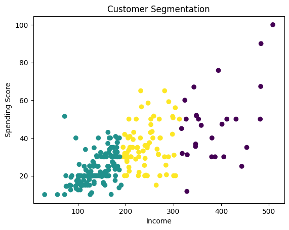
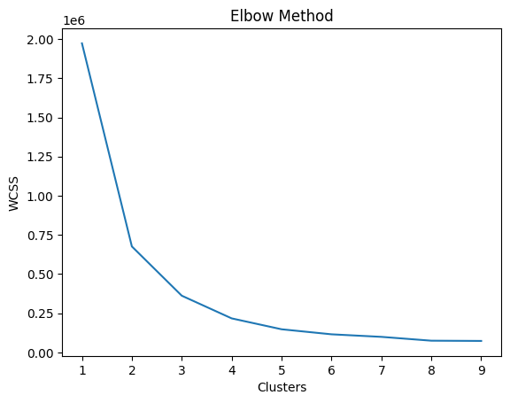

# 🧑‍🤝‍🧑 Customer Segmentation using Machine Learning

> Clustering-based project to segment customers into different groups based on income and spending behavior.

---

## 📌 Overview
This project focuses on segmenting customers using unsupervised machine learning techniques. By analyzing income and spending patterns, customers are grouped into meaningful segments for targeted marketing and business insights.

---

## ⚙️ Tech Stack
- Python
- Pandas, NumPy
- Scikit-learn
- Matplotlib

---

## 📊 Workflow
1. Data Loading & Preparation  
2. Feature Engineering (income & spending score)  
3. Data Visualization  
4. K-Means Clustering  
5. Elbow Method for optimal clusters  
6. Segment labeling (Low, Mid, High Value customers)  

---

## 🤖 Model Used
- K-Means Clustering

---

## 📈 Key Insights
- Identified 3 distinct customer segments  
- High-value customers show high income and high spending  
- Mid-value customers represent average spending behavior  
- Low-value customers are price-sensitive  

---

## 🎯 Business Impact
- Helps in targeted marketing campaigns  
- Improves customer retention strategies  
- Enables personalized recommendations  

---

## 📷 Results

### 🔹 Customer Segmentation

### 🔹 Elbow Method

